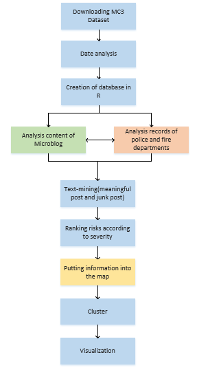
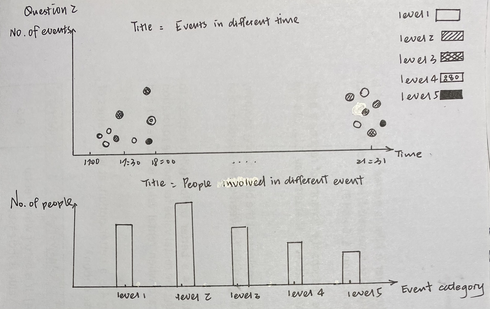
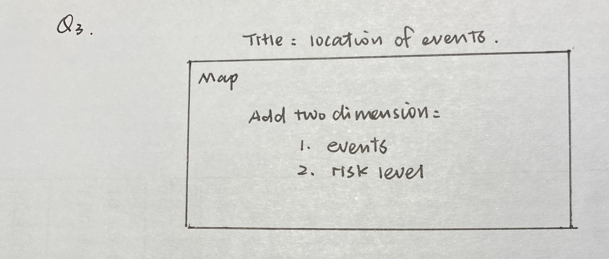

```{r setup, include=FALSE}
knitr::opts_chunk$set(echo = FALSE)
```


# 1.0 Background
  
### Introduction

In the country island of Kronos, the increasing noxious effects on health and farming have been related to the uncontrolled activity of GAStech, a natural gas operator, supported by corrupt government officials. On January 20th, 2014, a corporate meeting is held to celebrate the new-found fortune because of the initial public offering of the company. However, a series of rare events occur that lead to the disappearance of several employees. The Protectors of Kronos
(POK), a social movement organization that has been fighting against water contamination and government corruption, is suspected in the disappearance.

As analysts, we were assigned with several tasks in order to identify risks and how they could have been mitigated more effectively.

### Objective
Tasks are

* Distinguish meaningful event reports from typical chatter from junk or spam.
* Evaluate the level of the risk to the public evolves over the course of the evening. Consider the potential consequences of the situation and the number of people who could be affected.
* Determine the appropriate location for first responders. 
* The differences between dealing with this challenge in 2014 and dealing with it now.

---

# 2.0 Data Source

  
The data source is from [<font color = blue>*Vast Challenge 2021.*</font>](http://visualdata.wustl.edu/varepository/VAST%20Challenge%202019/challenges/Mini-Challenge%201/entries/California%20State%20University/). The data has

* Microblog records that have been identified by automated filters as being potentially relevant to the ongoing incident.
* Text transcripts of emergency dispatches by the Abila, Kronos local police and fire departments.
* Maps of Abila and Kronos Island.

---

# 3.0 The overall procedure.
  
The overall procedure is depicted in the picture.



### The task one
We will use keywords, posting authors and other relevant information to identify meaningful information and spam information. We also compare the records of the police and fire department to verify if it is valid information.
We would like to use two ways to show the results.

* Using word cloud present key words of meaningful post and junk post.
* Using histogram or bar chart present the words features(like sentence length) of meaningful and junk post.

### The task two
We will ranking risks from level 1 to level 5 according to the severity. Level 5 is the most serious.

This is the original thought of visualization.



### The task three
We would like to compare the map and event information to show events took place in which area of the island.



And then we want to use cluster model(variables: time, latitude, longitude and risk level) to classify events.

### The task four